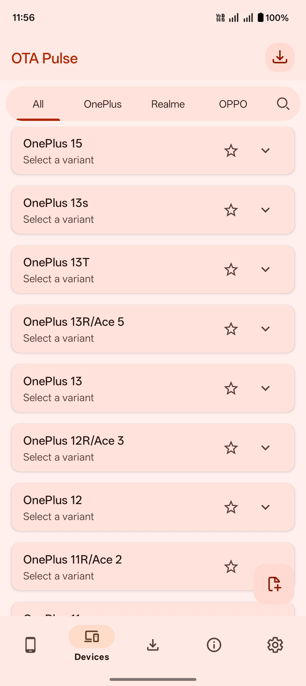
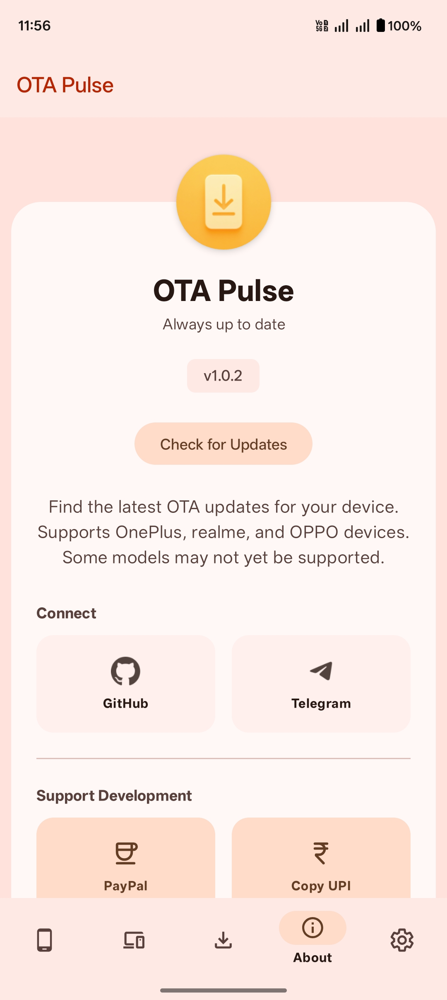
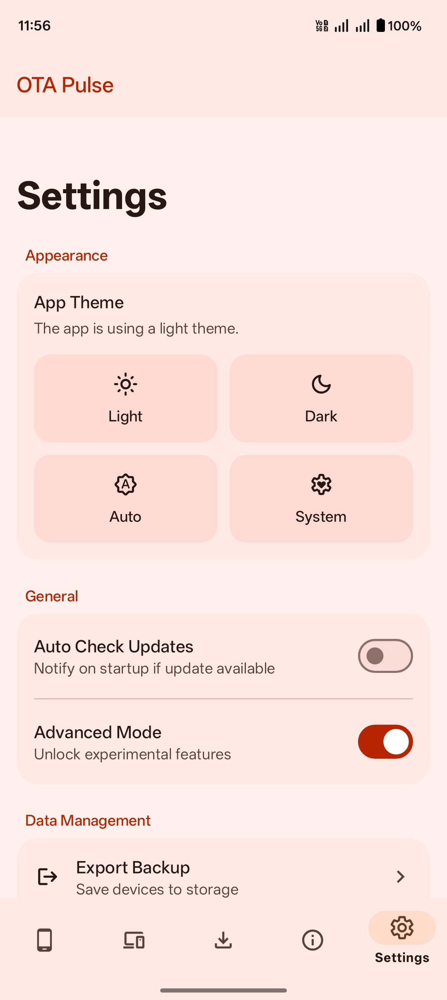

# OTA Pulse

    

## 📱 Introduction
OTA Pulse is a modern Android application designed to simplify the process of downloading and managing Over-the-Air (OTA) updates. Built with a clean user interface and robust architecture, it ensures a seamless experience for devices from major brands like **OnePlus**, **Realme**, and **OPPO**.

---

## 📱 Requirements

* **Android Version:** Android 10 (API Level 29) or higher.
* **Internet Connection:** Required for fetching updates and device details.

---

## ✨ Features

* **Wide Device Support:** Compatible with a growing list of `OnePlus`, `Realme`, and `OPPO` devices.
* **Custom Profiles:** Create your own device profiles to extend functionality to unsupported devices.
* **Download Manager:** Full control to pause, resume, cancel, and retry downloads. Supports manual URL downloads.
* **Device Insights:** Detailed breakdown of hardware (SoC, CPU, RAM) and software (OS, Security Patch).
* **Background Tasks:** Downloads continue in the background using WorkManager, complete with interactive notifications.
* **In-App Updater:** Automatically checks for app updates from GitHub and notifies you of new versions.
* **Android 16 Support:** Full support for Android 16 `downloadCheck` links and resolution logic.
* **Security:** Communication secured via AES and RSA encryption.
* **Modern UI:** A blend of standard Android Views and Jetpack Compose.

---

## 📸 Screenshots

Tap image to view full screenshots • Swipe left/right on mobile →

<table>
  <tr>
    <td>
      
    </td>
    <td>
      
    </td>
    <td>
      
    </td>
    <td>
      
    </td>
  </tr>
</table>

---

## 📥 Download

Get the latest version of OTA Pulse from the [releases page](https://github.com/CodeSenseiX/OTAPulse/releases).

---

## 👉 Join OTAPulse
- **[OTAPulse-Channel](https://t.me/abhinav_v1)**.
- **[OTAPulse-Discussion](https://t.me/abhinav_vchat)**.

---

## 🙏 Credits
* **[realme-ota](https://github.com/R0rt1z2/realme-ota):** Special thanks to R0rt1z2 for the underlying logic and inspiration.
